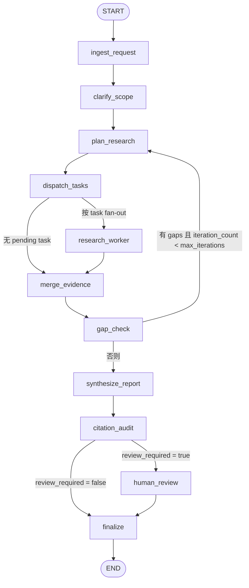

# 当前 LangGraph 图分析

## 1. 范围与入口

本分析基于当前后端实现，覆盖以下文件：

- `app/graph/builder.py`
- `app/graph/state.py`
- `app/graph/nodes/*.py`
- `app/graph/subgraphs/research_worker.py`
- `app/runtime.py`
- `app/run_manager.py`
- `app/run_store.py`
- `app/api/routes.py`
- `app/api/schemas.py`
- `app/domain/models.py`

目标是描述“当前代码实际实现的图”，而不是设计目标或未来规划。

## 2. 图的总览

主图由 `app/graph/builder.py` 中的 `build_graph()` 构建，使用 `StateGraph(GraphState)` 作为状态容器。图中注册了 11 个节点：

1. `ingest_request`
2. `clarify_scope`
3. `plan_research`
4. `dispatch_tasks`
5. `research_worker`
6. `merge_evidence`
7. `gap_check`
8. `synthesize_report`
9. `citation_audit`
10. `human_review`
11. `finalize`

### 2.1 主流程图

### 2.2 执行阶段划分

- 请求规范化阶段：`ingest_request` -> `clarify_scope`
- 计划阶段：`plan_research`
- 并行研究阶段：`dispatch_tasks` -> `research_worker`
- 证据收敛阶段：`merge_evidence` -> `gap_check`
- 报告生成阶段：`synthesize_report` -> `citation_audit`
- 人审与收尾阶段：`human_review` -> `finalize`

## 3. 状态模型

图状态定义在 `app/graph/state.py`：

| 字段 | 类型 | 作用 |
|------|------|------|
| `request` | `dict` | 标准化后的研究请求 |
| `tasks` | `list[dict]` | 当前轮待执行的研究任务 |
| `raw_findings` | `list[dict]` | worker 原始证据，使用 `operator.add` 聚合 |
| `raw_source_batches` | `list[dict]` | worker 原始来源批次，使用 `operator.add` 聚合 |
| `findings` | `list[dict]` | 去重后的证据列表 |
| `sources` | `dict[str, dict]` | `source_id -> source document` 映射 |
| `gaps` | `list[str]` | 缺口检查产出的后续问题 |
| `warnings` | `list[str]` | 报告审计告警 |
| `draft_report` | `str` | 生成阶段产出的草稿 |
| `final_report` | `str` | 最终返回的报告 |
| `iteration_count` | `int` | 已完成的计划轮次 |
| `review_required` | `bool` | 是否需要人工审阅 |

### 3.1 初始化状态

`app/runtime.py` 中的 `build_initial_state()` 会在首次运行时把上述字段全部初始化。这样图内节点基本可以假定字段存在，不必处理大量缺省分支。

### 3.2 聚合语义

`raw_findings` 和 `raw_source_batches` 使用 `Annotated[..., operator.add]`，说明它们被设计成并行 worker 的累加型字段。`research_worker` 负责往这两个字段追加数据，`merge_evidence` 再统一收敛。

## 4. 节点职责与状态变化

### 4.1 `ingest_request`

文件：`app/graph/nodes/ingest.py`

职责：

- 读取传入的 `request`
- 用 `normalize_request_payload()` 对 `max_iterations`、`max_parallel_tasks` 做 clamp
- 用 `ResearchRequest` 做 Pydantic 校验
- 返回完整状态快照

特点：

- 这是图的请求入口校验点
- 它不是只返回局部更新，而是把整份状态重新铺开，起到“规范化已有状态”的作用

### 4.2 `clarify_scope`

文件：`app/graph/nodes/clarify.py`

职责：

- 如果请求中没有 `scope`，填充默认 scope 文本

特点：

- 当前实现非常轻，只做默认值补全
- 没有触发额外 LLM 澄清流程

### 4.3 `plan_research`

文件：`app/graph/nodes/planner.py`

职责：

- 读取 `request.question`
- 结合当前 `gaps`
- 调用 `app/services/planning.py` 中的 `plan_research_tasks()`
- 生成新的 `tasks`
- 将 `iteration_count + 1`

特点：

- 图中所有“重新规划”都回到这个节点
- 规划器支持两条路径：
  - 可用 LLM 时，尝试结构化输出 `ResearchPlan`
  - 不可用时，走 deterministic fallback

### 4.4 `dispatch_tasks`

文件：`app/graph/nodes/dispatcher.py`

职责：

- `dispatch_tasks()` 本身不修改状态，返回空字典
- `route_research_tasks()` 负责真正路由

路由逻辑：

- 从 `tasks` 中筛出 `status == "pending"` 的任务
- 若没有 pending task，直接跳到 `merge_evidence`
- 若存在 pending task，返回多个 `Send("research_worker", {...})`

特点：

- 当前 fan-out 的最小输入是：
  - `request`
  - 单个 `task`
- 主状态里的其他字段不会直接下发给 worker

### 4.5 `research_worker`

文件：`app/graph/subgraphs/research_worker.py`

职责：

1. 作为单个 research task 的内部子图包装器
2. 校验 `task` 与 `request`
3. 依次执行子阶段：
   - `rewrite_queries`
   - `search_and_rank`
   - `fetch_and_filter`
   - `extract_and_score`
   - `emit_results`
4. 产出：
   - `raw_findings`
   - `raw_source_batches`

特点：

- 这是图里最核心的 task 级外部 I/O 执行边界
- 外层仍把它当作单个 `research_worker` 节点，但内部已经拆成子图
- 查询改写、搜索结果排序、页面筛选、证据评分在子图里完成
- `app/tools/extract.py` 现在只负责正文提取和 `SourceDocument` 生成
- 如果没有抓到有效内容，仍返回空列表而不是抛错，保持外层契约兼容

### 4.6 `merge_evidence`

文件：`app/graph/nodes/merge.py`

职责：

- 将所有 `raw_source_batches` 合并成单个 `sources`
- 调用 `dedupe_findings()` 对 `raw_findings` 做去重
- 输出标准化后的 `findings` 和 `sources`

特点：

- 它是原始 worker 输出与后续逻辑之间的收口点
- 去重键由 `task_id + source_id + claim.lower().strip()` 组成
- 冲突时保留 `confidence + relevance_score` 更高的版本

### 4.7 `gap_check`

文件：`app/graph/nodes/gap_check.py`

职责：

- 判断哪些任务没有采到证据
- 判断证据来源是否缺少交叉印证
- 产出 `gaps`

条件路由 `after_gap_check()`：

- 如果存在 `gaps` 且 `iteration_count < request.max_iterations`，回到 `plan_research`
- 否则进入 `synthesize_report`

特点：

- 这是图里的闭环控制点
- 重新规划依赖 `gaps` 文本，而不是结构化 gap 对象

### 4.8 `synthesize_report`

文件：`app/graph/nodes/synthesize.py`

职责：

- 调用 `app/services/synthesis.py` 中的 `synthesize_report()`
- 将报告 markdown 写入 `draft_report`

特点：

- 与 planner 类似，也有 LLM 和 fallback 双路径
- fallback 会基于 `tasks`、`findings`、`sources` 拼出确定性的 markdown

### 4.9 `citation_audit`

文件：`app/graph/nodes/audit.py`

职责：

- 检查 `draft_report` 是否为空
- 若存在 findings，检查是否包含内联引用
- 校验引用的 `source_id` 是否都存在于 `sources`
- 产出：
  - `warnings`
  - `review_required`

条件路由 `after_audit()`：

- `review_required == true` -> `human_review`
- 否则 -> `finalize`

特点：

- 人审触发条件有两类：
  - 出现未知 citation
  - 环境配置 `REQUIRE_HUMAN_REVIEW=true`

### 4.10 `human_review`

文件：`app/graph/nodes/review.py`

职责：

- 调用 `interrupt(...)` 暂停图执行
- 把以下内容暴露给外部恢复方：
  - `kind: "human_review"`
  - `draft_report`
  - `warnings`
- 在 resume 时接收外部输入

恢复逻辑：

- 默认 `final_report = draft_report`
- 如果 resume payload 是字典，则尝试读取 `edited_report`
- 写回：
  - `final_report`
  - `review_required = False`

特点：

- 当前实现只消费 `edited_report`
- API schema 中 `approved` 字段存在，但图内没有读取该字段

### 4.11 `finalize`

文件：`app/graph/nodes/finalize.py`

职责：

- 若已有 `final_report` 就直接返回
- 否则回退到 `draft_report`

特点：

- 它是一个非常薄的尾节点
- 主要目的是保证终态一定有 `final_report`

## 5. 路由与循环行为

### 5.1 并行分发

`dispatch_tasks` 使用 `Send` 对每个 pending task 生成一个 `research_worker` 调用，这说明研究阶段是按 task 粒度并行展开的。

当前实现里，worker 的输出通过 reducer 字段累加，然后在 `merge_evidence` 中统一收口。也就是说，图的并行边界很清晰：

- 节点内不做全局合并
- 合并动作集中在 `merge_evidence`

### 5.2 迭代闭环

闭环仅出现在 `gap_check -> plan_research`：

- 首轮 `plan_research` 后开始执行任务
- 若有缺口且预算未耗尽，则把 `gaps` 重新喂给 planner
- `iteration_count` 每次进入 planner 时递增

因此这个图的循环不是“按 worker 重试”，而是“按计划轮次重规划”。

### 5.3 人工中断与恢复

只有 `human_review` 会触发 LangGraph interrupt。运行时以 `__interrupt__` 作为“中断态”的判定依据：

- `run_research()` / `resume_research()` 在 `runtime.py` 中执行图
- `_read_graph_snapshot()` 会把图快照与 `__interrupt__` 一并返回
- `ResearchRunManager._finish_execution()` 看到 `__interrupt__` 时，把 run 状态标记为 `interrupted`
- 前端或调用方再通过 `/api/research/runs/{run_id}/resume` 提交恢复载荷

## 6. 图与运行时/存储/API 的关系

### 6.1 首次运行

入口链路：

`POST /api/research/runs`
-> `ResearchRunManager.create_run()`
-> 后台任务 `_execute_run()`
-> `run_research(request_payload, run_id)`
-> `build_graph(checkpointer=AsyncSqliteSaver(...))`
-> `graph.ainvoke(initial_state, config={"configurable": {"thread_id": run_id}})`

这里的 `run_id` 同时承担两件事：

- 业务运行 ID
- LangGraph checkpoint 的 `thread_id`

### 6.2 恢复运行

恢复链路：

`POST /api/research/runs/{run_id}/resume`
-> `ResearchRunManager.resume_run()`
-> 后台任务 `_execute_resume()`
-> `resume_research(run_id, resume_payload)`
-> `graph.ainvoke(Command(resume=resume_payload), config=...)`

说明：

- 恢复并不会重建初始状态
- 它依赖 checkpointer 中保存的线程状态继续向后执行

### 6.3 结果持久化

`ResearchRunStore` 负责把运行结果写入 `research_runs` 表：

- 创建时状态为 `queued`
- 启动执行时切到 `running`
- 有 `__interrupt__` 时存成 `interrupted`
- 正常终止时存成 `completed`
- 异常时存成 `failed`

持久化的是 run 级状态，不是图内部逐节点事件。

### 6.4 事件流

`GET /api/research/runs/{run_id}/events` 提供 SSE：

- `run.created`
- `run.status_changed`
- `run.progress`
- `run.interrupted`
- `run.completed`
- `run.failed`
- `run.resumed`

这些事件来自 `ResearchRunManager`，不是 LangGraph 原生 trace 事件，因此粒度是“运行态事件”，不是“节点级事件”。

## 7. 当前实现的关键特征

### 7.1 图的 orchestration 很显式

工作流顺序、分支、循环都集中在 `builder.py` 与少数 route helper 中，符合“编排逻辑留在图层，副作用留在工具层”的结构。

### 7.2 LLM 不是硬依赖

planner 和 synthesizer 都有 fallback：

- 没有模型配置时，图仍然可以完成
- 只是计划质量和报告质量会退化到模板化结果

### 7.3 worker 不维护任务生命周期

`ResearchTask` 有 `pending/running/done/failed` 状态定义，但当前代码里没有节点更新 task status。`dispatch_tasks` 只是按 `pending` 过滤，planner 重新生成任务列表时状态默认仍是 `pending`。

这意味着当前图更像“每轮重新生成任务清单并执行”，而不是“对同一批任务做显式状态流转”。

### 7.4 中断只服务于报告审阅

当前唯一 interrupt 点是 `human_review`。图不会在“缺证据”“工具失败”“任务失败”时中断给人工，而是继续靠 gap loop 或空结果向前推进。

### 7.5 运行态与图态是两层状态

- 图态：`GraphState`
- 运行态：`ResearchRunDetail.status`

两者通过 `runtime.py` 的快照读取和 `run_manager.py` 的状态映射衔接，但没有逐节点持久化映射。

## 8. 一个完整执行样例

### 8.1 正常完成路径

1. API 收到 `RunRequest`
2. `ingest_request` 校验并规范化请求
3. `clarify_scope` 填充默认 scope
4. `plan_research` 生成任务
5. `dispatch_tasks` fan-out 到多个 `research_worker`
6. worker 搜索、抓取、抽取证据
7. `merge_evidence` 合并来源并去重
8. `gap_check` 发现没有缺口或预算用尽
9. `synthesize_report` 生成草稿
10. `citation_audit` 通过
11. `finalize` 输出最终报告
12. run 状态写为 `completed`

### 8.2 人工审阅路径

1. 执行到 `citation_audit`
2. 因未知 citation 或强制人审把 `review_required` 设为 `true`
3. 进入 `human_review`
4. 图返回 `__interrupt__`
5. run 状态写为 `interrupted`
6. 外部调用 `/resume`
7. `human_review` 读取 `edited_report`
8. `finalize` 输出 `final_report`
9. run 状态写为 `completed`

## 9. 结论

当前 LangGraph 图是一个“请求规范化 -> 规划 -> 并行研究 -> 缺口回环 -> 报告生成 -> 引用审计 -> 人审收尾”的显式编排流程。

它的几个核心实现特征是：

- 使用 `GraphState` 统一状态载体
- 用 `Send` 实现按任务粒度的 fan-out
- 用 reducer 字段承接并行 worker 输出
- 用 `gap_check` 控制迭代回环
- 用 `interrupt/resume` 承接人工审阅
- 用 `run_manager + run_store` 管理图外部的业务运行状态

如果后续要继续演进，这份文档可以直接作为：

- 前端接入运行态与中断恢复的参考
- 后端补节点级事件观测的基线
- 更新 `.trellis/spec/backend/research-agent-runtime.md` 时的现状对照
