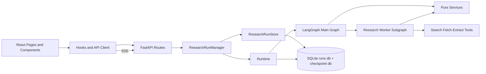
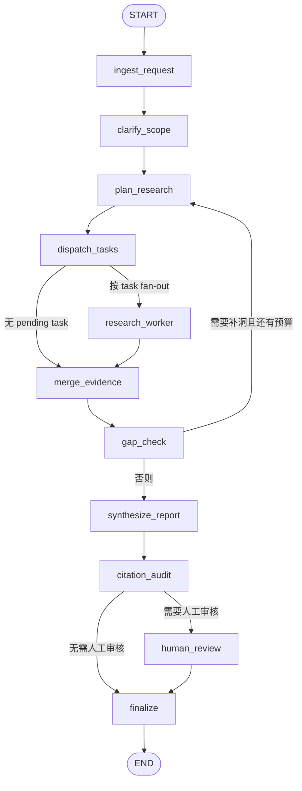

# Deep Research 流程分析

## 1. 目标与范围

本文基于当前仓库代码，梳理 `deep research` 的实际执行流程，覆盖以下范围：

- 前端入口与页面路由：`web/src/app/router.tsx`
- 前端提交、查询、SSE 订阅：`web/src/components/ConversationComposer.tsx`、`web/src/hooks/useConversations.ts`、`web/src/hooks/useResearchRuns.ts`、`web/src/hooks/useRunEvents.ts`
- API 边界：`app/api/routes.py`、`app/api/schemas.py`
- run 生命周期与事件分发：`app/run_manager.py`
- 持久化：`app/run_store.py`
- 运行时与 checkpoint 恢复：`app/runtime.py`
- LangGraph 主图与 worker 子图：`app/graph/builder.py`、`app/graph/nodes/*.py`、`app/graph/subgraphs/research_worker.py`
- 纯服务与工具边界：`app/services/*.py`、`app/tools/*.py`

本文只描述代码中已经实现的行为，不描述未来规划。

## 2. 架构概览

### 显式事实

- 后端是一个 FastAPI 应用，启动时在 `lifespan()` 中初始化 `ResearchRunManager`，并挂到 `app.state.run_manager` 上，供所有 API 路由复用。
- 后端把职责按层拆开：
  - `app/api/`：HTTP 路由与 Pydantic schema
  - `app/run_manager.py`：run 生命周期、后台任务、SSE 事件扇出
  - `app/run_store.py`：SQLite 持久化
  - `app/runtime.py`：LangGraph 执行与 checkpoint 恢复
  - `app/graph/`：主图节点和 worker 子图
  - `app/services/`：规划、质量门、综合、会话记忆、报告契约等纯逻辑
  - `app/tools/`：搜索、抓取、抽取等外部 I/O
- 前端是独立的 Vite + React package，主入口路由在 `web/src/app/router.tsx`，运行态通过 React Query + SSE 与后端同步。

### 推断

- 当前系统更接近“分层的模块化单体 + LangGraph 工作流编排”，而不是微服务。
- `deep research` 的核心编排被显式放在图节点和 run manager 中，而不是藏在工具内部。这是一个有意维持的边界。

## 3. 模块地图

| 模块 | 关键文件 | 职责 |
|---|---|---|
| 前端路由层 | `web/src/app/router.tsx` | 定义首页、会话页、运行列表页和旧 run 链接跳转 |
| 前端交互层 | `web/src/components/ConversationComposer.tsx` | 收集问题、范围、输出语言、迭代次数、并行任务数 |
| 前端数据层 | `web/src/hooks/useConversations.ts`、`web/src/hooks/useResearchRuns.ts` | 发起创建、追问、详情查询和恢复请求 |
| 前端实时层 | `web/src/hooks/useRunEvents.ts` | 订阅 SSE，实时回写 React Query 缓存 |
| API 层 | `app/api/routes.py` | 暴露 run / conversation / resume / events 接口 |
| 生命周期层 | `app/run_manager.py` | 创建 run、启动后台任务、更新状态、发布事件 |
| 持久化层 | `app/run_store.py` | 管理 `conversations`、`conversation_messages`、`research_runs`、`conversation_memory` |
| 运行时层 | `app/runtime.py` | 基于 `run_id` 作为 `thread_id` 执行或恢复 LangGraph |
| 主图层 | `app/graph/builder.py` | 串起 ingest、规划、派发、补洞、综合、审计、人审、收尾 |
| worker 子图 | `app/graph/subgraphs/research_worker.py` | 单个 research task 的查询改写、检索、抓取、抽取、评分 |
| 纯服务层 | `app/services/planning.py`、`app/services/research_quality.py`、`app/services/synthesis.py` | 规划、质量门、报告综合、记忆构造 |
| 工具层 | `app/tools/search.py`、`app/tools/fetch.py`、`app/tools/extract.py` | 搜索 provider 聚合、页面获取、正文抽取与来源标准化 |

## 4. 依赖方向

### 关键依赖说明

- 前端页面不直接理解后端实现细节，而是通过 `web/src/lib/api.ts` 和 `web/src/types/research.ts` 绑定 HTTP 契约。
- API 路由基本不承载业务逻辑，只负责把请求转给 `ResearchRunManager`。
- `ResearchRunManager` 同时依赖：
  - `ResearchRunStore`，用于 run / conversation / message / memory 的持久化
  - `run_research()` / `resume_research()`，用于驱动图执行
- 图节点主要依赖 `app/services/` 的纯逻辑；真正的外部访问被留在 `app/tools/`。
- `runtime.py` 和 `run_store.py` 各自使用 SQLite，但用途不同：
  - `run_store.py` 管业务态历史与会话数据
  - `runtime.py` 使用 LangGraph checkpoint 存图执行状态

## 5. 主图执行流程

主图由 `app/graph/builder.py` 中的 `build_graph()` 构建，节点顺序如下：

1. `ingest_request`
2. `clarify_scope`
3. `plan_research`
4. `dispatch_tasks`
5. `research_worker`
6. `merge_evidence`
7. `gap_check`
8. `synthesize_report`
9. `citation_audit`
10. `human_review`
11. `finalize`

### 5.1 节点职责

- `ingest_request`
  - 规范化请求预算，并验证 `request`、`memory`、`gaps`、`quality_gate` 等字段。
- `clarify_scope`
  - 当 `scope` 缺失时补默认说明，不触发额外 LLM 澄清。
- `plan_research`
  - 调用 `plan_research_tasks()` 生成本轮任务，并把 `iteration_count + 1`。
- `dispatch_tasks`
  - 找出 `pending` 任务，为每个任务发一个 `Send("research_worker", ...)`。
- `research_worker`
  - 作为 task 级子图，负责检索、抓取、抽取和证据评分。
- `merge_evidence`
  - 合并 worker 输出的 source batch，并对 findings 做去重。
- `gap_check`
  - 根据每个 task outcome 识别 `gaps`，并给出 `quality_gate` 结果。
- `synthesize_report`
  - 生成 `draft_report` 和 `draft_structured_report`。
- `citation_audit`
  - 审计引用完整性、结构化报告一致性，并决定是否需要人工审核。
- `human_review`
  - 调用 LangGraph `interrupt()` 暂停，等待外部恢复。
- `finalize`
  - 输出最终报告字段。

## 6. 核心执行路径

### 6.1 新建研究

这是当前默认用户路径。

1. 用户在 `web/src/pages/HomePage.tsx` 进入首页。
2. `ConversationComposer` 收集输入，并在提交时构造 `ConversationTurnRequest`。
3. `useCreateConversationMutation()` 调用 `createConversation()`，请求 `POST /api/research/conversations`。
4. `app/api/routes.py::create_conversation()` 把 payload 交给 `ResearchRunManager.create_conversation()`。
5. `ResearchRunManager` 内部调用 `_create_turn_in_new_conversation()`：
   - 生成 `conversation_id`、`run_id`、用户消息 ID、助手消息 ID
   - 用空的 conversation memory 作为初始上下文
6. `ResearchRunStore.create_conversation_turn()` 一次性写入：
   - `conversations`
   - `conversation_messages` 中的 user message
   - `conversation_messages` 中的 assistant placeholder message
   - `research_runs` 中状态为 `queued` 的 run
7. `ResearchRunManager` 发布 `run.created` 事件，并以后台任务启动 `_execute_run()`。
8. `_execute_run()` 会：
   - 先把状态更新为 `running`
   - 发布 `run.status_changed` 与 `run.progress`
   - 调用 `run_research(request_payload, run_id, memory_context)`
9. `app/runtime.py::run_research()`：
   - 用 `run_id` 作为 `thread_id`
   - 打开 LangGraph SQLite checkpoint
   - 构造初始状态并执行主图
10. 图执行完后返回状态快照。
11. `ResearchRunManager._finish_execution()` 根据结果决定终态：
   - 含 `__interrupt__` 时记为 `interrupted`
   - 否则记为 `completed`
12. `ResearchRunStore.store_result()` 写回 `result_json`，并更新 assistant message 内容。
13. `ResearchRunManager` 重建并持久化 conversation memory，然后发布终态事件。
14. 前端 `useRunEvents()` 通过 SSE 收到事件，实时更新：
   - run 详情缓存
   - run 列表缓存
   - conversation 详情缓存
   - conversation 列表缓存
15. `ConversationPage` 和 `ConversationThread` 基于缓存展示最新状态与报告。

### 6.2 单个 research task 的 worker 流程

`dispatch_tasks` 不直接做检索，而是把任务派发到 `research_worker` 子图。子图内部顺序如下：

1. `rewrite_queries_node`
   - 基于 task 和 request 组合最多 3 个查询。
2. `search_and_rank_node`
   - 调用 `search_web()`，聚合 Tavily / Brave 搜索结果。
   - 再用 `rank_search_hits()` 做排序与 host 多样性控制。
3. `acquire_and_filter_node`
   - 优先使用 provider 自带的 `raw_content`
   - 不够时再 HTTP 抓取
   - 最后才退化为 snippet
4. `extract_and_score_node`
   - `extract_sources()` 把内容标准化成 `SourceDocument`
   - `build_task_evidence()` 选 snippet、算 `relevance_score` / `confidence`
5. `emit_results_node`
   - 输出 `raw_findings`
   - 输出 `raw_source_batches`
   - 额外输出 `task_outcomes`

这里有一个很重要的边界：worker 子图可以做外部 I/O，但质量判断、排序、打分和补洞判断仍然在服务层或主图层完成。

### 6.3 补洞与质量门

`gap_check` 不直接基于“有没有 findings”做简单判断，而是读取 `task_outcomes`：

- 搜索结果为空，会形成 `retrieval_failure`
- 抓取失败，会形成 `retrieval_failure`
- 来源 host 少于 2，会形成 `low_source_diversity`
- 证据少于 2，会形成 `weak_evidence`

然后 `evaluate_quality_gate()` 决定：

- 还有迭代预算：`should_replan = True`，回到 `plan_research`
- 没有迭代预算：`requires_review = True`，后续通过警告或人审兜底

这意味着当前系统不是“一次规划，一次综合”，而是带质量门的闭环：

`计划 -> 执行 -> 收敛 -> 评估 -> 重新规划或综合`

### 6.4 报告生成与引用审计

`synthesize_report()` 会优先尝试 LLM 综合；如果 LLM 不可用或没有 findings，则退化到 deterministic fallback。

输出不是单纯 Markdown，而是结构化报告：

- `draft_report`
- `draft_structured_report`

`citation_audit()` 会做三类检查：

1. Markdown 是否为空
2. findings 存在时，是否包含内联 `[Sxxxx]` 引用
3. 结构化报告中的 `sections`、`cited_source_ids`、`citation_index` 是否一致

任何缺引用、引用未知 source、结构索引不同步，都可能触发 `review_required = True`。

### 6.5 人工审核与恢复

当 `citation_audit()` 判断需要人审，或配置强制人审时，图会进入 `human_review()`：

1. `human_review()` 调用 `interrupt(...)`，把 `draft_report`、`draft_structured_report`、`warnings` 暴露给外部。
2. `runtime.py` 读取到 `__interrupt__` 后，`ResearchRunManager` 会把 run 状态写成 `interrupted`。
3. 前端通过 SSE 收到 `run.interrupted`，页面展示审核面板。
4. 用户在 `ReviewPanel` 中提交编辑后的报告，请求 `POST /api/research/runs/{run_id}/resume`。
5. `ResearchRunManager.resume_run()` 把状态改回 `running`，发布 `run.resumed`，后台执行 `resume_research(run_id, resume_payload)`。
6. `runtime.py::resume_research()` 用同一个 `thread_id=run_id` 调用 `Command(resume=resume_payload)` 恢复图执行。
7. `human_review()` 读取 `edited_report` 后重建 `final_structured_report`，再进入 `finalize`。
8. 最终 run 进入 `completed`。

## 7. 追问流程与会话记忆

当前产品主入口是“会话”而不是“独立 run”。

### 显式事实

- `ConversationPage` 会读取某个 conversation 的完整消息和 run 列表。
- 追问由 `POST /api/research/conversations/{conversation_id}/messages` 驱动。
- 前端提交追问时会把最近一个 `run_id` 作为 `parent_run_id` 带上。
- `ResearchRunManager.create_message()` 会：
  - 读取 conversation
  - 读取持久化 memory
  - 校验 parent run 是否属于当前 conversation，且不在活动态
  - 调用 `build_memory_context()` 生成新的 `memory_context`

### 会话记忆的作用

`ConversationMemoryPayload` 包含：

- `rolling_summary`
- `recent_turns`
- `key_facts`
- `open_questions`

这份 memory 会传给：

- `plan_research_tasks()`，用于延续上下文和术语
- `synthesize_report()`，用于输出带背景的 `Conversation Context` 段落

但代码中也明确做了约束：

- memory 是 continuity context，不是 citation source
- 报告里的事实引用仍然必须来自 `sources` / `findings`

这是当前实现里一个关键边界，避免“把历史对话当证据”。

## 8. 持久化与事件模型

### 8.1 SQLite 持久化内容

`ResearchRunStore.initialize()` 会准备四张表：

- `conversations`
- `conversation_messages`
- `research_runs`
- `conversation_memory`

其中：

- `research_runs` 保存请求、结果、状态、错误、完成时间
- `conversation_messages` 把 user / assistant 消息线程化保存
- `conversation_memory` 保存压缩后的历史记忆

### 8.2 事件模型

SSE 事件类型定义在前后端共享契约中，包括：

- `run.created`
- `run.status_changed`
- `run.progress`
- `run.interrupted`
- `run.completed`
- `run.failed`
- `run.resumed`

`ResearchRunManager._build_event()` 还会把以下对象一起塞进事件 payload：

- `run`
- `conversation` summary
- `assistant_message`

因此前端收到单个事件后，就可以同时更新多个缓存切片，而不需要再次发额外查询。

## 9. 当前 deep research 流程的关键设计点

### 9.1 图节点只负责编排，纯逻辑留在服务层

这符合当前仓库的明确约束：

- 图节点负责读状态、调服务/工具、写局部状态
- 排序、去重、评分、补洞、综合等逻辑留在 `app/services/`
- 搜索、抓取、抽取等外部副作用留在 `app/tools/`

### 9.2 支持“无 LLM 也能跑通”的 deterministic fallback

至少两个关键环节有 fallback：

- `plan_research_tasks()`
- `synthesize_report()`

所以即使缺少 LLM 凭证，系统仍能走完“规划 -> 研究 -> 综合”的主链路，只是报告质量和任务拆分会更保守。

### 9.3 恢复机制依赖 checkpoint，而不是手工重建中间态

恢复不是重新跑完整流程，而是：

- 用 `run_id` 找到同一条图线程
- 通过 `Command(resume=...)` 从中断点继续

这也是为什么 `run_id` 同时承担了 run 标识和 LangGraph `thread_id` 的角色。

## 10. 一句话总结

当前仓库里的 `deep research` 流程，本质上是：

前端把问题组织成 conversation turn，后端把 turn 落成 run 与消息线程，再由 `ResearchRunManager` 异步驱动 LangGraph 主图执行；主图会规划多个 research task，交给 worker 子图并行做检索、抓取、抽取与打分，在主图中统一收敛、补洞、综合和审计，必要时中断等待人工审核，最后通过 SQLite 持久化结果并用 SSE 持续把状态推回前端。

## 11. 延伸阅读

- 更细的节点级图分析：`docs/current-langgraph-graph.md`
