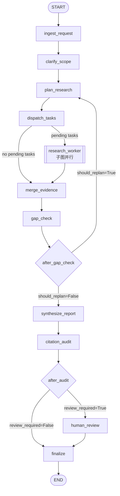

# Deep Research 流程分析

## 1. 整体架构

Deep Research 是一个基于 **LangGraph + LangChain（Python 后端）** 和 **React + Vite（前端）** 的多步研究代理。核心流程由一张主状态图（StateGraph）驱动，在必要时通过子图（Subgraph）并行执行具体的研究任务。

### 核心设计原则

- **状态变更只在 Graph Node 中发生**：纯业务逻辑下沉到 `app/services/`
- **外部副作用只在 Tool 层发生**：所有网络 I/O 集中在 `app/tools/`
- **支持确定性降级**：当 LLM 凭证不可用时，仍有 fallback 逻辑保证流程继续
- **引用可审计**：报告中的 `source_id` 必须真实存在于 `sources` 中

---

## 2. 主状态图（Main Graph）

主图文件：`app/graph/builder.py`

### 2.1 节点详解

#### `ingest_request`
- 职责：规范化并验证请求负载（`ResearchRequest`），恢复对话记忆、历史 task outcomes、gaps、quality_gate 等状态。
- 作用：确保所有进入图的状态都是类型安全、结构一致的。

#### `clarify_scope`
- 职责：确认研究范围（scope）。如果用户未指定，填充默认范围描述。
- 同时发送进度事件：`clarifying_scope`。

#### `plan_research`
- 职责：根据当前问题、上一轮 gaps、对话记忆生成研究任务列表。
- **迭代计数器**：`iteration_count` 自增。
- **任务 ID 规则**：`iter-{iteration}-task-{index}`。
- **双路径规划**：
  - 优先尝试 LLM 规划（`app/services/planning.py` 的 `_maybe_plan_with_llm`）
  - 若 LLM 不可用或无凭证，则使用 fallback 规划（`_build_fallback_plan`），基于 gaps 或默认种子主题生成任务

#### `dispatch_tasks`
- 职责：调度待执行的研究任务。
- **条件路由 `route_research_tasks`**：
  - 若无 pending tasks，直接跳至 `merge_evidence`
  - 否则通过 `langgraph.types.Send` 向 `research_worker` 子图并行派发多个任务

#### `research_worker`（子图）
见第 3 节。

#### `merge_evidence`
- 职责：合并所有子图返回的结果。
- 操作：
  - 将 `raw_source_batches` 合并到 `sources`（去重）
  - 对 `raw_findings` 执行去重（`app/services/dedupe.py`）

#### `gap_check`
- 职责：评估本轮研究质量，识别知识缺口（gaps）。
- **缺口识别逻辑**（`app/services/research_quality.py`）：
  - `retrieval_failure`：任务未产生 outcome / 无搜索命中 / 内容获取失败
  - `missing_evidence`：有内容但无法提取证据
  - `low_source_diversity`：来源主机数 < 2
  - `weak_evidence`：证据条目 < 2
  - `coverage_gap`：缺乏近期来源、缺乏具体数据/案例、缺乏风险/局限性分析
- **质量门控 `QualityGateResult`**：
  - `passed=True`：无 gaps，继续合成报告
  - `should_replan=True`：有 gaps 且仍有迭代预算（`iteration_count < max_iterations`），返回 `plan_research` 重新规划
  - `requires_review=True`：有 gaps 但预算耗尽，强制进入人工审核

#### `synthesize_report`
- 职责：将 findings 和 sources 合成为结构化报告。
- **两阶段合成策略**（`app/services/synthesis.py`）：
  1. **单阶段 LLM 合成**：当 findings/sources 数量在预算内时，一次性调用 LLM 生成完整报告草案
  2. **多阶段分段合成**：若超出预算，按 section plan 分块调用 LLM，每块独立生成后再合并
  3. **Fallback 报告**：LLM 不可用时，基于 findings 直接拼接结构化列表式报告
- **报告章节结构**：
  - 按任务分章（每个 task 对应一个 report_heading）
  - 风险与局限（`risks_heading`）
  - 结论（`conclusion_heading`）
- **输出**：`draft_report`（markdown）+ `draft_structured_report`（`StructuredReport` 结构化对象）

#### `citation_audit`
- 职责：审计引用合法性和报告结构完整性。
- 检查项：
  - 报告是否为空
  - findings 存在时报告是否包含行内引用（`[source_id]` 形式）
  - 报告引用的 `source_id` 是否全部存在于 `sources` 中
  - 结构化报告各章节是否有引用
  - 引用索引（`citation_index`）是否与正文中引用的来源一致
- **结果**：生成 warnings；若存在严重引用问题，则设置 `review_required=True`

#### `human_review`
- 职责：通过 `langgraph.types.interrupt` 暂停图执行，等待人工干预。
- 人工可编辑报告内容；确认后继续执行，并根据最终报告重新推导结构化报告。

#### `finalize`
- 职责：将 `draft_report` 提升为 `final_report`，输出最终结果。

---

## 3. 研究任务子图（Research Worker Subgraph）

子图文件：`app/graph/subgraphs/research_worker.py`

每个 pending task 都会启动一个独立的子图实例，所有实例在主图中**并行执行**。

### 3.1 节点详解

#### `rewrite_queries`
- 职责：根据 task 和主请求，重写/生成搜索查询语句（`app/services/research_worker.py` 的 `rewrite_queries`）。

#### `search_and_rank`
- 职责：调用搜索工具（`app/tools/search.py` 的 `search_web`）获取候选结果。
- 流程：
  - 候选上限：`max(10, search_max_results * 3)`
  - 对返回结果进行相关性排序和截断（`rank_search_hits`）

#### `acquire_and_filter`
- 职责：获取搜索命中的页面内容，并过滤低质量内容。
- 获取链路：
  1. `acquire_contents`：基础 HTTP 获取
  2. 若开启 `enable_jina_reader_fallback`，对获取失败的内容尝试 Jina Reader
  3. 若开启 `enable_firecrawl_fallback`，再尝试 Firecrawl
- 过滤：最终保留最多 6 条、最少 2 条高质量内容（`filter_acquired_contents`）

#### `extract_and_score`
- 职责：从获取的内容中提取可用来源和证据点。
- 操作：
  - `extract_sources`：将 `AcquiredContent` 转换为 `SourceDocument`
  - `build_task_evidence`：基于来源提取具体的 evidence claims
- 产出：`sources` + `findings`

#### `emit_results`
- 职责：汇总子图执行结果，构建 `ResearchTaskOutcome`，并返回给主图。
- 返回字段：`raw_findings`、`raw_source_batches`、`task_outcomes`

---

## 4. 状态定义（GraphState）

文件：`app/graph/state.py`

| 字段 | 类型 | 说明 |
|------|------|------|
| `request` | dict | 用户请求（`ResearchRequest`） |
| `memory` | dict | 对话记忆（`ConversationMemoryPayload`） |
| `tasks` | list[dict] | 当前轮次规划的研究任务 |
| `raw_findings` | Annotated[list, operator.add] | 子图返回的原始 findings（LangGraph 自动累加） |
| `raw_source_batches` | Annotated[list, operator.add] | 子图返回的原始 source batches（自动累加） |
| `task_outcomes` | Annotated[list, operator.add] | 子图返回的任务执行结果（自动累加） |
| `findings` | list[dict] | 去重合并后的 evidence |
| `sources` | dict[str, dict] | 去重合并后的来源文档 |
| `gaps` | list[dict] | 本轮识别的知识缺口 |
| `quality_gate` | dict | 质量门控结果 |
| `warnings` | list[str] | 审计和流程中的警告 |
| `draft_report` | str | 合成阶段的 markdown 报告 |
| `draft_structured_report` | dict | 结构化报告对象 |
| `final_report` | str | 最终报告 |
| `final_structured_report` | dict | 最终结构化报告 |
| `iteration_count` | int | 当前迭代次数 |
| `review_required` | bool | 是否需要人工审核 |

> `Annotated[..., operator.add]` 的字段表示 LangGraph 在并行子图执行后会自动做列表拼接。

---

## 5. 关键机制

### 5.1 迭代重规划（Replan Loop）

- 触发条件：`gap_check` 发现 gaps 且 `iteration_count < max_iterations`
- 行为：通过条件边 `after_gap_check` 返回 `plan_research`，基于已有的 gaps 生成新的 tasks
- 默认最大迭代次数：`2`（可在请求中配置 `1~5`）

### 5.2 质量门控（Quality Gate）

- 基于 `identify_research_gaps` 的结果评估
- 三个核心字段：
  - `passed`：是否通过
  - `should_replan`：是否应重规划
  - `requires_review`：是否强制人工审核

### 5.3 引用审计（Citation Audit）

- 保证报告只引用真实存在的 `source_id`
- 防止幻觉引用：通过正则解析 markdown 中的 `[source_id]`，与 `sources` 键集合比对
- 结构化报告额外检查章节引用和索引同步

### 5.4 人工审核（Human Review）

- 通过 LangGraph 的 `interrupt` 机制实现
- 触发条件：
  - `quality_gate.requires_review=True`
  - `citation_audit` 发现严重引用问题
  - 全局配置 `require_human_review=True`

### 5.5 确定性降级（Deterministic Fallback）

- 当 `can_use_llm(settings)` 返回 False 时，所有依赖 LLM 的节点均有 fallback：
  - **Planning**：使用基于 gaps 的预设任务模板
  - **Synthesis**：使用 findings 拼接列表式报告
  - **Heading Assignment**：使用任务 title 的规则化清理版本

---

## 6. 服务层职责划分

| 服务文件 | 职责 |
|----------|------|
| `app/services/planning.py` | 研究任务规划（LLM / Fallback） |
| `app/services/synthesis.py` | 报告合成（单阶段/多阶段/fallback） |
| `app/services/research_quality.py` | 缺口识别、质量评估、task outcome 构建 |
| `app/services/dedupe.py` | findings 去重 |
| `app/services/citations.py` | 引用解析、缺失引用检测 |
| `app/services/report_contract.py` | 结构化报告构建、默认标题/标签 |
| `app/services/research_worker.py` | query 重写、搜索排序、内容过滤 |
| `app/services/conversation_memory.py` | 对话记忆格式化、上下文摘要 |
| `app/services/llm.py` | LLM 模型构建、可用性检查 |

---

## 7. 数据流转总结

1. **请求进入** → `ingest_request` 验证并初始化状态
2. **范围澄清** → `clarify_scope` 确保 scope 存在
3. **任务规划** → `plan_research` 生成 `tasks`，`iteration_count` +1
4. **并行执行** → `dispatch_tasks` 将每个 pending task 发送至 `research_worker` 子图
5. **子图内部** → query 重写 → 搜索 → 内容获取 → 证据提取 → 返回 findings/sources/outcomes
6. **证据合并** → `merge_evidence` 去重并聚合所有子图结果
7. **质量检查** → `gap_check` 识别 gaps，决定：重规划 / 继续合成 / 强制审核
8. **报告合成** → `synthesize_report` 基于 findings 生成 markdown + 结构化报告
9. **引用审计** → `citation_audit` 检查引用合法性，决定是否需要审核
10. **人工审核**（可选）→ `human_review` 中断流程，等待用户编辑
11. **最终输出** → `finalize` 产出 `final_report` 和 `final_structured_report`

---

## 8. 进度事件体系

所有主要节点在执行时都会通过 `app/runtime_progress.py` 的 `emit_progress` 发送进度事件，前端可订阅 SSE 流实时展示：

| 阶段 | phase |
|------|-------|
| 澄清范围 | `clarifying_scope` |
| 规划任务 | `planning` |
| 执行任务 | `executing_tasks` |
| 合并证据 | `merging_evidence` |
| 检查缺口 | `checking_gaps` |
| 重规划 | `replanning` |
| 合成报告 | `synthesizing` |
| 审计引用 | `auditing` |
| 等待审核 | `awaiting_review` |
| 最终化 | `finalizing` |

每个事件都包含：当前 phase、iteration/max_iterations、任务进度、统计计数（tasks/sources/evidence/warnings）以及是否需要审核。
