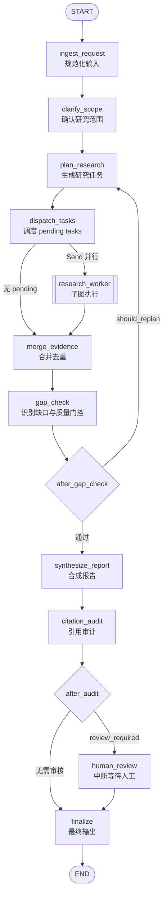
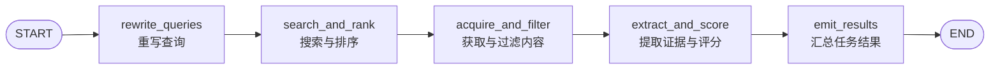

# Deep Research Graph 节点详细分析

本文档对 Deep Research 工作流中 **主状态图（Main Graph）** 和 **研究任务子图（Research Worker Subgraph）** 的每个节点进行逐层解剖，说明其职责、状态读写、核心调用链和关键设计决策。

---

## 1. 图构建器总览

### 1.1 主图：`app/graph/builder.py`

```python
def build_graph(checkpointer=None):
    builder = StateGraph(GraphState)
    builder.add_node("ingest_request", ingest_request)
    builder.add_node("clarify_scope", clarify_scope)
    builder.add_node("plan_research", plan_research)
    builder.add_node("dispatch_tasks", dispatch_tasks)
    builder.add_node("research_worker", research_worker)
    builder.add_node("merge_evidence", merge_evidence)
    builder.add_node("gap_check", gap_check)
    builder.add_node("synthesize_report", synthesize_report_node)
    builder.add_node("citation_audit", citation_audit)
    builder.add_node("human_review", human_review)
    builder.add_node("finalize", finalize)

    builder.add_edge(START, "ingest_request")
    builder.add_edge("ingest_request", "clarify_scope")
    builder.add_edge("clarify_scope", "plan_research")
    builder.add_edge("plan_research", "dispatch_tasks")
    builder.add_conditional_edges("dispatch_tasks", route_research_tasks)
    builder.add_edge("research_worker", "merge_evidence")
    builder.add_edge("merge_evidence", "gap_check")
    builder.add_conditional_edges("gap_check", after_gap_check)
    builder.add_edge("synthesize_report", "citation_audit")
    builder.add_conditional_edges("citation_audit", after_audit)
    builder.add_edge("human_review", "finalize")
    builder.add_edge("finalize", END)
    return builder.compile(checkpointer=checkpointer)
```

**设计要点**：
- `checkpointer` 传入 `AsyncSqliteSaver`，用于在 `human_review` 的 `interrupt` 处持久化状态。
- 3 条 **条件边（conditional edges）** 控制循环与分支：
  - `dispatch_tasks` → `route_research_tasks`
  - `gap_check` → `after_gap_check`
  - `citation_audit` → `after_audit`

---

## 2. 主图节点（Main Graph Nodes）

### 2.1 `ingest_request`

**文件**：`app/graph/nodes/ingest.py`

**职责**：
作为图的入口门卫，将外部传入的原始状态规范化、验证并反序列化为类型安全的数据结构。确保后续所有节点读取到的状态字段都符合 `Pydantic` 模型约束。

**读状态**：
- `request`：原始请求 payload（dict）
- `memory`：原始对话记忆（dict 或空）
- `task_outcomes`、`gaps`、`quality_gate`：从 checkpoint 恢复的历史状态
- 其余字段直接透传（`tasks`、`raw_findings`、`sources`、`warnings` 等）

**写状态**：
- 重写 `request` 为 `ResearchRequest.model_dump()`
- 重写 `memory` 为 `ConversationMemoryPayload.model_dump()`
- 将 `task_outcomes` 和 `gaps` 逐项验证并序列化
- 将 `quality_gate` 验证为 `QualityGateResult`
- 其余字段原样返回（做了一次浅拷贝式的状态重建）

**核心调用**：
- `app.services.budgets.normalize_request_payload(state["request"], settings)`：对请求做预算和参数规范化（如填充默认值、校验范围）。

**设计意图**：
- 隔离外部输入的不确定性。即使前端传入的字段类型不一致，也能在图的最开始被统一纠正。

---

### 2.2 `clarify_scope`

**文件**：`app/graph/nodes/clarify.py`

**职责**：
确认并补全研究范围（scope）。如果用户没有显式提供 scope，赋予一个默认的研究目标描述，保证下游规划节点始终有明确的 scope 可用。

**读状态**：
- `state["request"]`

**写状态**：
- `request.scope`：若为空，设置为 `"Investigate the question, collect evidence, and produce a cited markdown report."`

**副作用**：
- 调用 `emit_progress(config, {...})`，发送 `phase="clarifying_scope"` 的进度事件。

**设计意图**：
- 避免规划节点因缺少 scope 而生成过于发散的任务。

---

### 2.3 `plan_research`

**文件**：`app/graph/nodes/planner.py`

**职责**：
根据用户问题、上一轮识别的 `gaps`、对话 `memory` 以及配置参数，生成本轮需要执行的研究任务列表 `tasks`。

**读状态**：
- `state["request"]`：提取 `question`、`max_parallel_tasks`、`max_iterations`
- `state["gaps"]`：上一轮的质量缺口，用于指导任务聚焦
- `state["memory"]`：对话记忆，用于保持术语和上下文连续性
- `state["iteration_count"]`：当前已执行的迭代次数

**写状态**：
- `tasks`：生成的任务列表，每个任务附带 `task_id = iter-{next_iteration}-task-{index}`
- `iteration_count`：自增 1

**核心调用链**：
1. `app.services.planning.plan_research_tasks(question, gaps, max_tasks, settings, memory)`
2. 内部先尝试 `_maybe_plan_with_llm`：
   - 使用 `ChatPromptTemplate` + `ChatOpenAI.with_structured_output(ResearchPlan)` 调用 planner LLM
   - Prompt 中注入 conversation memory（rolling summary、recent turns、key facts、open questions）和 gaps
3. 若 LLM 不可用或调用失败，则回退到 `_build_fallback_plan`：
   - 若有 gaps，按 gap 的 `title`/`reason`/`retry_hint` 构造任务
   - 若无 gaps，使用 3 个默认种子主题：Establish scope、Collect recent evidence、Synthesize tradeoffs

**设计意图**：
- **双路径规划**：优先 LLM 智能规划，但绝不因 LLM 失败而阻塞流程。
- **迭代命名规范**：任务 ID 带迭代前缀，便于在日志和 UI 中追踪是哪一轮生成的任务。

---

### 2.4 `dispatch_tasks`

**文件**：`app/graph/nodes/dispatcher.py`

**职责**：
调度节点本身不修改状态，仅作为 `route_research_tasks` 条件边的前置节点。条件边根据当前 `tasks` 中 pending 任务的数量，决定下一步走向。

**路由函数 `route_research_tasks`**：

```python
def route_research_tasks(state: dict):
    pending = [t for t in state.get("tasks", []) if t.get("status", "pending") == "pending"]
    if not pending:
        return "merge_evidence"
    return [Send("research_worker", {
        "request": state["request"],
        "task": task,
        "task_index": index,
        "task_total": len(pending),
        "iteration_count": state.get("iteration_count"),
    }) for index, task in enumerate(pending, start=1)]
```

**行为**：
- 无 pending tasks：直接跳转到 `merge_evidence`
- 有 pending tasks：使用 `langgraph.types.Send` 向 `research_worker` 子图 **并行发送** 多个任务。每个任务携带独立的子状态（包含 `task_index` 和 `task_total`，用于进度展示）。

**设计意图**：
- 利用 LangGraph 的 `Send` 机制实现 Map-Reduce 式的并行任务执行。

---

### 2.5 `research_worker`

**文件**：`app/graph/subgraphs/research_worker.py`

**职责**：
子图入口节点。它不是一个普通函数节点，而是 compiled subgraph 的调用器。接收主图通过 `Send` 传入的子状态，执行完整的 5 步研究任务链，最后将结果聚合回主图。

**读状态（子状态）**：
- `request`、`task`、`task_index`、`task_total`、`iteration_count`

**写状态（返回给主图）**：
- `raw_findings`：该任务提取到的 evidence 列表
- `raw_source_batches`：该任务保留的 sources（按 batch 组织为 dict）
- `task_outcomes`：该任务的执行元数据（搜索命中数、获取内容数、证据数等）

**设计意图**：
- 子图与主图状态隔离，子图内部使用 `ResearchWorkerState`（TypedDict），避免状态字段污染。
- 子图执行完毕后，LangGraph 自动将多个并行实例的 `Annotated[list, operator.add]` 字段在主图状态上做列表拼接。

---

### 2.6 `merge_evidence`

**文件**：`app/graph/nodes/merge.py`

**职责**：
在所有并行子图执行完毕后，统一合并、去重原始结果，生成干净的 `findings` 和 `sources`。

**读状态**：
- `raw_source_batches`：每个子图返回的 `{source_id: source_doc}` batch
- `raw_findings`：每个子图返回的 evidence 列表
- `tasks`、`task_outcomes`、`iteration_count`、`request`：用于进度统计

**写状态**：
- `sources`：将所有 batch 的 source dict 合并为一个大的 `dict[str, dict]`（后出现的覆盖先出现的）
- `findings`：调用 `dedupe_findings` 去重后的列表

**核心调用**：
- `app.services.dedupe.dedupe_findings(raw_findings)`

**副作用**：
- 发送 `phase="merging_evidence"` 进度事件，携带当前 source 数和 evidence 数。

**设计意图**：
- 子图只负责“生产”原始数据，主图在单点做归集和清洗，避免分布式状态冲突。

---

### 2.7 `gap_check`

**文件**：`app/graph/nodes/gap_check.py`

**职责**：
评估本轮研究产出的质量，识别未解决的问题、证据薄弱点或执行失败项，生成 `gaps` 和 `quality_gate`。

**读状态**：
- `tasks`：本轮规划的所有任务
- `task_outcomes`：各任务的执行结果
- `findings`：合并后的证据
- `sources`：合并后的来源
- `iteration_count`、`request.max_iterations`

**写状态**：
- `gaps`：缺口列表
- `quality_gate`：质量门控结果（`passed`/`should_replan`/`requires_review`）
- `warnings`：若 quality gate 未通过，追加格式化警告
- `review_required`：若 `quality_gate.requires_review` 为 True，则置为 True

**核心调用链**：
1. `app.services.research_quality.identify_research_gaps(tasks, task_outcomes, findings, sources)`
   - 按任务遍历，检查：
     - 任务是否有 outcome（无 → `retrieval_failure`）
     - outcome 质量状态是否为 `failed`（搜索失败/获取失败/提取失败 → 对应 severity=high 的 gap）
     - 来源主机数 `< 2` → `low_source_diversity`
     - 证据数 `< 2` → `weak_evidence`
     - 覆盖率检查：无近期来源、无具体数据/案例、无风险/局限 → `coverage_gap`
2. `app.services.research_quality.evaluate_quality_gate(gaps, has_iteration_budget)`
   - 无 gaps → `passed=True`
   - 有 gaps 且有预算 → `should_replan=True`
   - 有 gaps 但无预算 → `requires_review=True`

**副作用**：
- 发送 `phase="checking_gaps"` 进度事件
- 若需要重规划，额外发送 `phase="replanning"` 进度事件

---

### 2.8 `after_gap_check`（条件边）

**文件**：`app/graph/nodes/gap_check.py`

```python
def after_gap_check(state: dict) -> str:
    quality_gate = QualityGateResult.model_validate(state.get("quality_gate", {}))
    if quality_gate.should_replan:
        return "plan_research"
    return "synthesize_report"
```

**职责**：
根据 `quality_gate.should_replan` 决定：
- `True` → 返回 `plan_research`（进入下一轮迭代）
- `False` → 进入报告合成阶段

**设计意图**：
- 这是主图唯一的循环回边，控制整个研究的迭代深度。

---

### 2.9 `synthesize_report`

**文件**：`app/graph/nodes/synthesize.py`

**职责**：
将经过验证的 findings 和 sources 合成为人类可读的 markdown 报告，并同时生成结构化的 `StructuredReport`。

**读状态**：
- `request.question`
- `tasks`：用于按任务分章
- `findings`、`sources`
- `memory`：用于 synthesis prompt 中的背景 brief
- `request.output_language`：决定报告语言

**写状态**：
- `tasks`：可能被更新（`assign_report_headings` 会给每个 task 分配 `report_heading`）
- `draft_report`：markdown 字符串
- `draft_structured_report`：`StructuredReport` 的 dict 形式

**核心调用链**：
1. `app.services.synthesis.assign_report_headings(...)`
   - 尝试用 LLM 将任务 title 改写为更合适的报告章节标题
   - LLM 失败时回退到规则化清理（去掉前缀动词、首字母大写等）
2. `app.services.synthesis.synthesize_report(...)`
   - **单阶段合成**：当 findings/sources 数量在预算内，一次性调用 LLM 生成 `ReportDraft`
   - **多阶段分段合成**：超出预算时，按 `SectionPlan` 分块调用 LLM，每块独立生成 `ReportSectionDraft`，最后合并
   - **Fallback 报告**：LLM 不可用时，基于 findings 生成列表式章节（Summary + Task Sections + Risks + Conclusion）
3. `app.services.report_contract.build_structured_report(...)`
   - 将 `ReportDraft` 提升为完整的 `StructuredReport`，包含：
     - `title`、`summary`、`markdown`
     - `sections`（带 `cited_source_ids`）
     - `citation_index`、`source_cards`

**副作用**：
- 发送 `phase="synthesizing"` 进度事件。

**设计意图**：
- 合成策略按“成本/质量”分层：优先一次成型，必要时拆分成段，最坏情况下也有确定性输出。

---

### 2.10 `citation_audit`

**文件**：`app/graph/nodes/audit.py`

**职责**：
对合成出的报告进行引用合法性和结构完整性审计，防止 LLM 产生幻觉引用或生成空报告。

**读状态**：
- `draft_report`
- `draft_structured_report`
- `sources`
- `findings`
- `warnings`
- `quality_gate`
- `settings.require_human_review`

**写状态**：
- `warnings`：追加审计发现的警告
- `review_required`：若存在严重引用问题或配置强制审核，则设为 True

**核心调用链**：
1. `_read_structured_report`：
   - 尝试读取现有的 `draft_structured_report`
   - 若不存在或解析失败，调用 `derive_structured_report` 从 markdown 重新推导
2. `app.services.citations.has_citations(draft_report)`：检查 markdown 中是否有 `[source_id]` 形式的引用
3. `app.services.citations.find_missing_citations(draft_report, sources)`：找出报告中引用但不在 `sources` 中的 ID
4. `_validate_structured_report(structured_report, findings)`：
   - 检查是否有章节
   - 检查 Summary 是否有引用
   - 检查各非特殊章节是否有引用
   - 检查 `citation_index` 是否与正文引用的 `source_id` 同步
5. `_blocking_structural_warnings`：识别会导致强制审核的结构性警告

**副作用**：
- 发送 `phase="auditing"` 进度事件，携带 `review_required` 标志。

**设计意图**：
- 这是“最后一道防线”，确保最终交付物在引用上的可信度。

---

### 2.11 `after_audit`（条件边）

**文件**：`app/graph/nodes/audit.py`

```python
def after_audit(state: dict) -> str:
    if state.get("review_required"):
        return "human_review"
    return "finalize"
```

**职责**：
根据 `review_required` 标志决定：
- `True` → 进入 `human_review`
- `False` → 直接进入 `finalize`

---

### 2.12 `human_review`

**文件**：`app/graph/nodes/review.py`

**职责**：
通过 LangGraph 的 `interrupt` 机制暂停整个图执行，等待人工审核或修改报告。

**读状态**：
- `draft_report`
- `draft_structured_report`
- `warnings`
- `sources`、`findings`（用于从人工编辑后的 markdown 重新推导结构化报告）
- `request.output_language`

**写状态**：
- `final_report`：若用户提供了 `edited_report`，则使用用户版本；否则使用 `draft_report`
- `final_structured_report`：根据最终 markdown 重新推导的 `StructuredReport`
- `review_required`：设为 False（表示审核已通过）

**核心调用**：
- `langgraph.types.interrupt({"kind": "human_review", "draft_report": ..., "warnings": ...})`
- `app.services.report_contract.derive_structured_report(final_report, sources, findings, title_hint)`

**副作用**：
- 发送 `phase="awaiting_review"` 进度事件。

**设计意图**：
- `interrupt` 配合 `checkpointer` 使用，进程重启后可以从断点恢复，无需重新执行前面的研究步骤。

---

### 2.13 `finalize`

**文件**：`app/graph/nodes/finalize.py`

**职责**：
图的终点节点，负责将 draft 提升为 final，并发送最终进度事件。

**读状态**：
- `final_report`（若存在，说明经过了 human_review）
- `draft_report`（若未经过 human_review，则直接提升）
- `final_structured_report` / `draft_structured_report`

**写状态**：
- `final_report`：最终的 markdown 报告
- `final_structured_report`：最终的结构化报告

**副作用**：
- 发送 `phase="finalizing"` 进度事件，携带完整统计计数。

---

## 3. 子图节点（Research Worker Subgraph Nodes）

子图文件：`app/graph/subgraphs/research_worker.py`

### 3.1 `rewrite_queries`

**职责**：
根据当前任务内容和主请求问题，生成或重写一组更适合搜索引擎的查询语句。

**读子状态**：
- `task`
- `request`

**写子状态**：
- `queries`：字符串列表

**核心调用**：
- `app.services.research_worker.rewrite_queries(task, request, settings=settings)`

**设计意图**：
- 将研究任务“翻译”成搜索引擎能理解的关键词组合，提升召回率。

---

### 3.2 `search_and_rank`

**职责**：
调用搜索工具获取候选网页，并按相关性排序截断。

**读子状态**：
- `queries`
- `task`

**写子状态**：
- `search_hits`：`SearchHit` 的 dict 列表

**核心调用链**：
1. `app.tools.search.search_web(queries, max_results=candidate_limit)`
2. `app.services.research_worker.rank_search_hits(task, hits, limit=candidate_limit)`

**设计意图**：
- 先获取大量候选结果（`max(10, search_max_results * 3)`），再由业务逻辑层做精排，避免过早丢弃潜在优质来源。

---

### 3.3 `acquire_and_filter`

**职责**：
对搜索命中的 URL 进行内容获取，按质量过滤，并在必要时通过第三方服务（Jina Reader、Firecrawl）进行内容回退获取。

**读子状态**：
- `search_hits`
- `task`

**写子状态**：
- `acquired_contents`：`AcquiredContent` 的 dict 列表

**核心调用链**：
1. `app.tools.fetch.acquire_contents(hits)`：基础 HTTP 获取
2. 若 `enable_jina_reader_fallback`：
   - `should_escalate_to_jina_reader(item)` 识别获取失败项
   - `fetch_with_jina_reader(...)` 回退获取
3. 若 `enable_firecrawl_fallback`：
   - `should_escalate_to_firecrawl(item)` 识别获取失败项
   - `fetch_with_firecrawl(...)` 回退获取
4. `app.services.research_worker.filter_acquired_contents(task, acquired_contents, limit)`
   - 最终保留 `min(6, max(2, search_max_results + 2))` 条内容

**设计意图**：
- 构建多层内容获取防线：基础抓取 → Jina Reader → Firecrawl，最大化获取可用正文的概率。

---

### 3.4 `extract_and_score`

**职责**：
从获取到的网页内容中提取结构化来源文档（SourceDocument）和具体证据声明（Evidence）。

**读子状态**：
- `acquired_contents`
- `task`

**写子状态**：
- `sources`：`SourceDocument` 的 dict 列表
- `findings`：`Evidence` 的 dict 列表

**核心调用链**：
1. `app.tools.extract.extract_sources(contents)`：将 `AcquiredContent` 转换为 `SourceDocument`
2. `app.services.research_worker.build_task_evidence(task, sources, settings=settings)`
   - 基于 source 内容提取与任务相关的 evidence claims

**设计意图**：
- 将“原始网页内容”提升为“带引用的证据声明”，完成从非结构化数据到结构化 finding 的转换。

---

### 3.5 `emit_results`

**职责**：
汇总子图执行全过程的指标，构建 `ResearchTaskOutcome`，并将子图结果以主图状态可接受的格式返回。

**读子状态**：
- `queries`、`search_hits`、`acquired_contents`、`sources`、`findings`
- `task`、`task_index`、`task_total`、`iteration_count`

**写子状态**：
- `raw_findings`：该任务的 findings 列表
- `raw_source_batches`：`[{source_id: source_doc}, ...]`
- `task_outcomes`：`[ResearchTaskOutcome(...)]`

**核心调用**：
- `app.services.research_quality.build_task_outcome(task, query_count, search_hit_count, ...)`
  - 计算 `quality_status`：`ok` / `weak` / `failed`
  - 识别 `failure_reasons`：no_search_hits / content_acquisition_failed / insufficient_content / no_evidence_extracted
  - 统计 `host_count`（去重域名数）

**设计意图**：
- 子图的输出格式必须与主图的 `Annotated[list, operator.add]` 字段匹配，以便 LangGraph 自动归并。

---

## 4. 节点间数据流转速查表

| 节点 | 主要读字段 | 主要写字段 | 是否发进度 |
|------|-----------|-----------|-----------|
| `ingest_request` | `request`, `memory`, `task_outcomes`, `gaps`, `quality_gate` | 全部字段规范化 | ❌ |
| `clarify_scope` | `request` | `request.scope` | ✅ |
| `plan_research` | `request`, `gaps`, `memory`, `iteration_count` | `tasks`, `iteration_count` | ✅ |
| `dispatch_tasks` | `tasks` | —（路由边控制） | ❌ |
| `research_worker` | `request`, `task` 等子状态 | `raw_findings`, `raw_source_batches`, `task_outcomes` | ✅（子图内部） |
| `merge_evidence` | `raw_findings`, `raw_source_batches` | `findings`, `sources` | ✅ |
| `gap_check` | `tasks`, `task_outcomes`, `findings`, `sources`, `iteration_count` | `gaps`, `quality_gate`, `warnings`, `review_required` | ✅ |
| `synthesize_report` | `request`, `tasks`, `findings`, `sources`, `memory` | `tasks`, `draft_report`, `draft_structured_report` | ✅ |
| `citation_audit` | `draft_report`, `draft_structured_report`, `sources`, `findings`, `warnings` | `warnings`, `review_required` | ✅ |
| `human_review` | `draft_report`, `draft_structured_report`, `warnings` | `final_report`, `final_structured_report`, `review_required` | ✅ |
| `finalize` | `final_report`/`draft_report`, `final_structured_report`/`draft_structured_report` | `final_report`, `final_structured_report` | ✅ |

---

## 5. Mermaid 节点关系图

### 5.1 主图节点



### 5.2 Research Worker 子图节点


